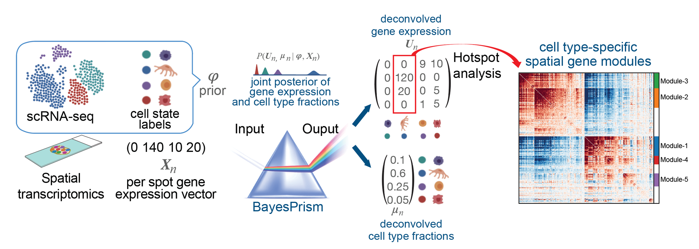
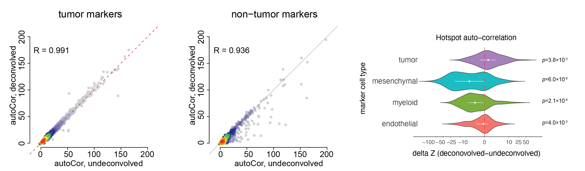
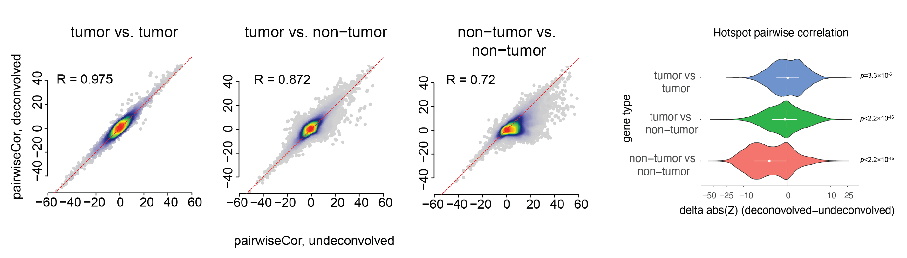

# PrismSpot

PrismSpot
========

PrismSpot aims at inferring cell type-specific spatial gene co-expression modules from low resolution spatial transcriptomics data, e.g. 10x Visium. It uses the deconvolved gene expression outputted by BayesPrism (https://github.com/Danko-Lab/BayesPrism.git) as the input for Hotspot analysis (https://github.com/YosefLab/Hotspot.git). Using the deconovovled gene expression profile increases the signal-to-noise ration for inferring cell type-specific spatial gene co-expression modules.

1. Workflow of PrismSpot
--------

2. Performance of PrismSpot
--------
We compared auto-correlation and pairwise local correlation Z scores from the Hotspot analysis obtained from PrismSpot and direct application of Hotspot on the total expression measured by Visium. We focused our analysis on inferring tumor-specifc modules, and benchmarked the auto-correlation and local correlations scores over a set of marker genes. PrismSpot improved the signal-to-noise ratio for inferring tumor-specific gene modules. 

* auto-correlation Z scores:

* pairwise local correlation Z scores:

3. Files in this repository:
PrismSpot.ipynb : jupyter notebook for loading the output of BayesPrism followed by Hotspot analysis of transcription factors. 
export_BayesPrism.R: R script that outputs the deconvolved gene expression of tumor cells for Hotspot analysis. 
benchmark.R: R script that compares PrismSpot to direct direct applying Hotspot on raw Visium data. 